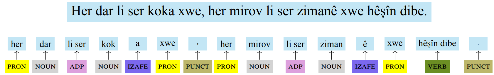
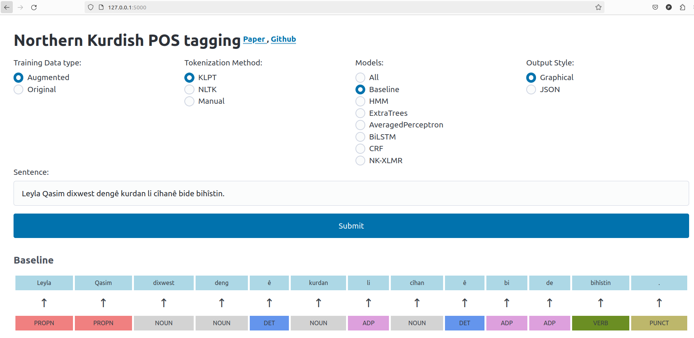

# Part-of-Speech Tagging for Northern Kurdish
<p align="center">
  
<em> Manually tokenized and POS-tagged proverb in Northern Kurdish ‘As every tree
stands over its roots, so does every human blossom with their mother tongue.’ </em>
</p>

This repository provides access to all trained and ready-to-use POS models and the training and test data discussed in our [MWE-UD 2024 paper](https://peshmerge.io/publications/morad2024kmrpos.pdf).


## Repository structure

### datasets

This folder contains the: 
- `gold_data.tsv` the gold-standard manually annotated and tokenized dataset which consists of 136 sentences(2,937 tokens).
- `kmr_mg-ud-complete-augmented.conllu` the UD Kurmanji augmented dataset. 

### models

This folder contains 7 sub folders where you can find all our trained POS models. All sub folders contain two model variants `original` and `augmented`. 

- `Baseline`
- `HMM`
- `ExtraTrees`
- `AveragedPerceptron`
- `BiLSTM`
- `CRF`
- `NK-XLMR`

The folders `BiLSTM` and `NK-XLMR` are empty since their models are very big and therefore uploaded to Google Drive. 

`BiLSTM` model variants link: [Google Drive](https://drive.google.com/file/d/1mfIO055CqfI-pVEWk21WcbxBGne4j5D3/view?usp=sharing) (5.02 GB). Download the zip file and extract its content to `BiLSTM` sub folder.

`NK-XLMR` model variants link: [Google Drive](https://drive.google.com/file/d/1Zk-RI2RrjSxW1r65xm4n6GgIRAUrx7X5/view?usp=sharing) (2.46 GB). Download the zip file and extract its content to `NK-XLMR` sub folder.

### `pos_cli.py` 
This file offers a CLI interface to interact with the models. The file can be called within the command line with the following arguments:

- `python pos_cli --pos_model CRF --training_data_type augmented --sentence "Leyla Qasim dixwest dengê kurdan li cîhanê bide bihîstin." --tokenization_method KLPT`


### `pos_flask.py`

An alternative interface to the cli one to interact all POS models. Rund this file and then navigate to `http://127.0.0.1:5000/`
<p align="center">
  
<em> The web interface to interact with all POS models.  </em>
</p>


## Requirements
- Operating system: macOS / OS X · Linux · Windows
- Python version: Python 3.9.19

Clone the repo and run `pip install -r requirements.txt ` to install all dependencies.

## Cite this project
Please consider citing [this paper](https://peshmerge.io/publications/morad2024_kmr_pos.pdf), if you use any part of the data or the POS models:

```
@inproceedings{morad2024kmrpos,
  title = "Part-of-Speech Tagging for Northern Kurdish",
  author = "Morad, Peshmerge and Ahmadi, Sina and Gatti, Lorenzo",
  booktitle = "Proceedings of the Joint Workshop on Multiword Expressions and Universal Dependencies (MWE-UD 2024)",
  month = may,
  year = "2024",
  address = "Torino, Italy",
  publisher = "ELRA Language Resources Association"
}

```

## License

This work is licensed under a
[Creative Commons Attribution-ShareAlike 4.0 International License][cc-by-sa].

[![CC BY-SA 4.0][cc-by-sa-image]][cc-by-sa]

[cc-by-sa]: http://creativecommons.org/licenses/by-sa/4.0/
[cc-by-sa-image]: https://licensebuttons.net/l/by-sa/4.0/88x31.png